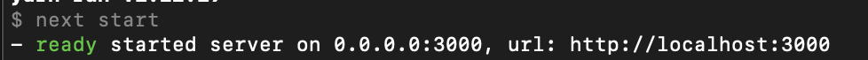

# 프리온보딩 사전 과제

날짜: June 29, 2023

### 원티드 프리온보딩 챌린지 - CSR / SSR with Next.js

### 과제 제출
1. CSR
    1. 이란? 
        1. WebSite자체를 요청하여 유저는 HTML,JS 같은 파일을 전부 받고 유저 즉 클라이언트에서 렌더링 하는 것을 말한다.
    2. 장단점
        1. 장점
            1. 한번 다운로드 받으면 더이상 페이지를 로드할 필요가 없기 때문에 렌더링이 빠르다.
            2. 서버 요청이 적어 사용되는 자원이 적다.
        2. 단점
            1. 처음 홈페이지를 로드하는 시간이 길다.
                1. 프로젝트가 커질 수 록 더 길어진다.
            2. SEO 최적화에서 불리하다.
2. SPA로 구성된 웹 앱에서 SSR이 필요한 이유는?
    1. CSR의 단점인 처음 홈페이지의 로드시간을 단축과 SEO 최적화 문제를 해결 할 수 있다.
    2. SPA라서 배포가 간단하다.
    3. SPA는 페이지간의 이동속도가 빨라 사용자 경험에 유리하다.
3. Next.js 프로젝트에서 `yarn start(or npm run start)` 스크립트를 실행했을 때 실행되는 코드를 Next.js Github 레포지토리에서 찾은 뒤, 해당 파일에 대한 간단한 설명을 첨부해주세요.

next.js/packages/next/src/cli

[next-start.ts](next-start.md)

- 스크립트 명령어에 따른 분기

packages/next/src/server/lib/start-server.ts

[start-server.ts](start-server.md)

- 스크립트 명령을 옵션으로 받고 셋업 서버 실행

packages/next/src/server/next.ts

[next.ts](next.md)

- dev 서버 실행

순서

1. next-start.ts
    
    ```tsx
      '--help': Boolean,
        '--port': Number,
        '--hostname': String,
        '--keepAliveTimeout': Number,
    ```
    
    - 해당 명령어들을 확인하고 처리한다.
    - 중간에 문제가 생기면 에러메세지와 함께 프로세스를 종료한다.
    - 문제가 없다면 startServer를 실행한다.
        
        ```tsx
        await startServer({
            dir,
            isDev: false,
            hostname: host,
            port,
            keepAliveTimeout,
            useWorkers: !!config.experimental.appDir,
          })
        ```
        
2. start-server.ts
    1. 서버생성 : server = http.createServer(…)
    2. 서버 실행 : server.listen(port, hostname) 
    3. 아래의 로그 생성
        
        
        
        ```tsx
        Log.ready(
                `started server on ${normalizedHostname}${
                  (port + '').startsWith(':') ? '' : ':'
                }${port}, url: ${appUrl}`
              )
        ```
        
    4. next ⇒ 실제 모듈함수 이름은 createServer로 서버를 생성
        - packages/next/src/server/next.ts
    5. prepare - next 서버 사용.
        1. dev인지 prod인지 확인하고 app 디렉토리가 제대로된 위치에 존재하는지 확인
        2. app 디렉토리가 없다면 서버를 다시 준비시킨다.
        3. app이 있다면 서버 핸들러 생성
        - 서버핸들러 생성
            
            [createServerHandler ](createServerHandler.md)
            
    
    ```tsx
    const app = next({...}) // next.ts/createServer
    
    await app.prepare()
    handlersReady()
    ```
